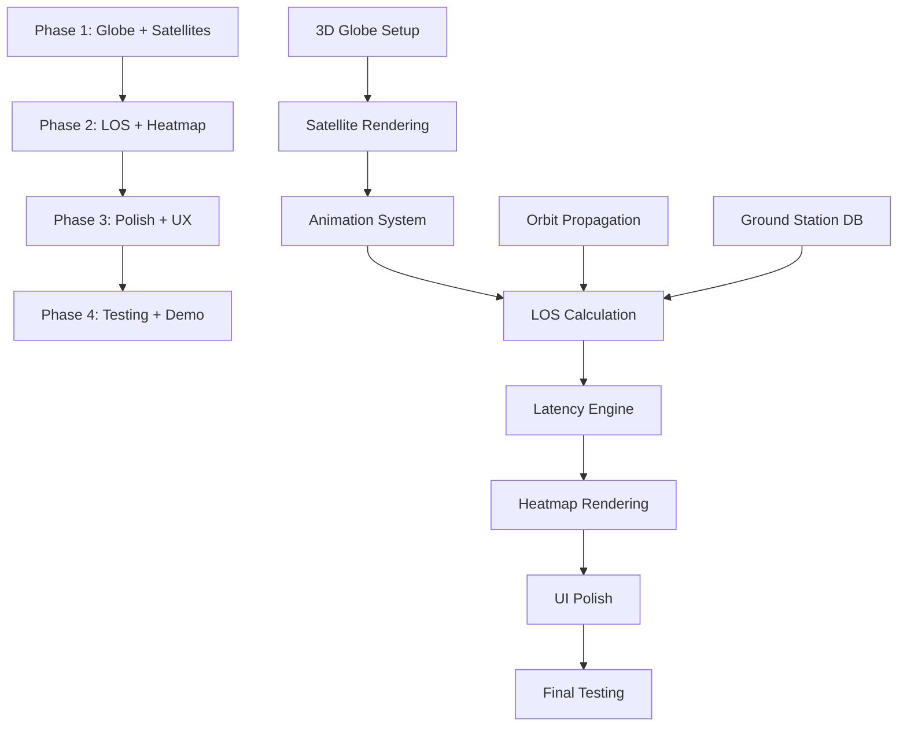

# IMPLEMENTATION PLAN (UPDATED)

## Team Composition (4-Person, 24 Hours)

| Role | Responsibilities | Skills Required | Hours Allocated |
|------|------------------|-----------------|-----------------|
| 3D/Graphics Dev | Three.js globe, satellite rendering, animations | Three.js, WebGL, 3D math | 22 hours |
| Backend Dev | Orbit propagation, LOS checks, latency engine, API | Python, FastAPI, SGP4, NumPy | 20 hours |
| Integration Dev | Real-time updates, ground station data, heatmap logic | Full-stack, WebSockets/polling | 18 hours |
| DevOps/QA | Ground station database, testing, documentation | Data management, testing | 12 hours |

**Total Capacity:** 72 person-hours over 24 hours

## Sprint Breakdown (24-Hour MVP)

### Phase 1: Foundation - Globe, Satellites & Ground Stations (Hours 0-7)

#### 3D/Graphics Tasks (3D/Graphics Dev):

**1.1: Set up Three.js scene with Earth sphere (texture mapping) (1.5 hours)** ✅ COMPLETE
- ✅ Use high-res Earth texture (NASA Blue Marble)
- ✅ Add ambient + directional lighting for realistic appearance
- ✅ Implement camera controls (orbit, zoom) - pan disabled to keep globe centered
- **Status:** Globe renders with interactive camera controls, texture displays correctly
- **See:** `TASK-1.1-THREEJS-GLOBE-SETUP.md` for detailed implementation

**1.2: Create satellite point rendering system (2 hours)**
- Render satellites as small spheres or billboarded sprites
- Color-code by orbit type (LEO=blue, MEO=green, GEO=red)
- Implement efficient instanced rendering for 50-100+ satellites

**1.3: Implement real-time satellite animation (2 hours)**
- Update satellite positions every frame based on propagated coordinates
- Smooth interpolation between 60-second calculation steps
- Add hover tooltips showing satellite name on mouseover

**1.4: Build satellite selection system (1.5 hours)**
- Raycasting for click detection on satellite points
- Highlight selected satellite (larger size, glow effect)
- Display satellite info panel (name, altitude, velocity, orbit type)

#### Backend Tasks (Backend Dev):

**1.5: Set up FastAPI project with WebSocket support (1 hour)**
- Configure CORS for local development
- Set up project structure (routes, services, models)

**1.6: Implement TLE fetching and caching (1.5 hours)**
- Fetch TLE data for 50-100 popular satellites from CelesTrak
- In-memory cache with 6-hour TTL
- Parse TLE into usable orbital elements

**1.7: Build SGP4 orbit propagation engine (2.5 hours)**
- Use Skyfield for SGP4 calculations
- Generate satellite positions every 60 seconds
- Convert ECI → ECEF → lat/lon/altitude coordinates
- Create `/api/v1/satellites/positions` endpoint returning all satellite positions

#### Integration Tasks (Integration Dev):

**1.8: Create ground station database (2 hours)** 🔄 IN PROGRESS
- Compile list of 50-100 real ground stations (coordinates + metadata)
- Include: amateur radio stations, research stations, commercial sites
- Format: JSON with `{id, name, lat, lon, elevation, type}`
- **Next Task:** See `TASK-1.2-GROUND-STATIONS.md` for detailed implementation plan
- **Goal:** Render ground stations as red dots on globe with click interaction

**1.9: Design real-time data flow architecture (1.5 hours)**
- Decide: WebSocket vs. polling (recommend polling every 1-2 seconds for MVP)
- Define API contracts for satellite positions and LOS calculations

**1.10: Implement frontend-backend communication (1.5 hours)**
- Fetch initial satellite positions on load
- Set up polling loop to update positions every 2 seconds
- Handle loading states and error scenarios

#### DevOps/QA Tasks (DevOps/QA Dev):

**1.11: Set up project repository and documentation (1 hour)**
- Initialize Git repo with proper .gitignore
- Create README with setup instructions
- Document API endpoints

**1.12: Prepare test data and validation cases (2 hours)**
- Known satellite passes (ISS over major cities)
- Ground station visibility test cases
- Expected latency ranges for validation

**Phase 1 Deliverable:** 3D Earth globe with real-time animated satellites, click-to-select functionality

**Current Progress:**
- ✅ Task 1.1: Three.js globe with Earth texture and camera controls - COMPLETE
- 🔄 Task 1.2: Ground station visualization (red dots) - NEXT
- ⏳ Task 1.2-1.4: Satellite rendering and selection - PENDING
- ⏳ Task 1.5-1.7: Backend orbit propagation - PENDING

### Phase 2: LOS Calculation & Ground Station Visibility (Hours 7-13)

#### Backend Tasks (Backend Dev):

**2.1: Implement Line-of-Sight (LOS) calculation (2.5 hours)**
- For selected satellite, calculate visibility to all ground stations
- Apply 10° minimum elevation angle mask
- Check Earth obstruction using spherical geometry
- Output: list of visible ground stations with elevation angles

**2.2: Build latency calculation engine (2 hours)**
- Calculate slant range for each visible ground station
- Base propagation delay = distance / speed_of_light
- Atmospheric delay model based on elevation angle
- Weather penalty (basic model: 0.5-5ms based on elevation)
- Processing delay (fixed 5ms)

**2.3: Create `/api/v1/satellite/{id}/ground-stations` endpoint (1.5 hours)**
- Input: `satellite_id`, `current_time`
- Output: JSON array of visible ground stations with latency values

Example response:

```json
{
  "satellite_id": "25544",
  "timestamp": "2025-12-12T10:30:00Z",
  "visible_stations": [
    {
      "station_id": "gs_001",
      "name": "San Francisco Amateur Radio",
      "lat": 37.7749,
      "lon": -122.4194,
      "elevation_deg": 45.3,
      "azimuth_deg": 215.6,
      "slant_range_km": 1250.5,
      "latency_ms": 9.2
    }
  ]
}
```

#### 3D/Graphics Tasks (3D/Graphics Dev):

**2.4: Render ground stations as colored dots (2 hours)**
- Create dot instances at ground station coordinates
- Initially render all stations as grey/inactive
- When satellite selected, highlight only visible stations

**2.5: Implement heatmap color gradient (2 hours)**
- Define color scale: Green (low latency) → Yellow → Orange → Red (high latency)
- Map latency values to colors (e.g., 5-8ms=green, 8-12ms=yellow, 12-15ms=orange, >15ms=red)
- Update dot colors based on latency data from backend

**2.6: Add satellite orbit track visualization (2 hours)**
- When satellite selected, draw ground track (past + future positions)
- Use line or tube geometry for visibility
- Color-code track by time (past=faded, future=bright)
- Show track for next 90 minutes (one orbit)

#### Integration Tasks (Integration Dev):

**2.7: Connect satellite selection to LOS calculation (2 hours)**
- On satellite click, fetch visible ground stations from API
- Update ground station dot visibility and colors
- Handle loading state during calculation (<1 second target)

**2.8: Implement real-time heatmap updates (2.5 hours)**
- As satellite moves, recalculate LOS every 10-30 seconds
- Smoothly transition dot colors (use CSS/Three.js color interpolation)
- Optimize: only recalculate if satellite moved significantly (>50km)

**2.9: Add ground station click interaction (1.5 hours)**
- Raycasting for ground station dot selection
- Display detailed info panel: station name, latency breakdown, elevation, azimuth
- Show latency components (propagation, atmospheric, weather, processing)

#### DevOps/QA Tasks (DevOps/QA Dev):

**2.10: Test LOS calculations with known scenarios (2 hours)**
- Verify ISS visibility matches reality (use Heavens-Above.com)
- Validate elevation angle calculations
- Check edge cases (polar regions, GEO satellites)

**2.11: Performance testing (1 hour)**
- Measure LOS calculation time (target: <500ms for 100 stations)
- Test Three.js rendering with 100+ dots (target: 60fps)

**Phase 2 Deliverable:** Functional LOS detection with real-time color-coded heatmap showing latency across visible ground stations

### Phase 3: Polish, Optimization & UX (Hours 13-19)

#### 3D/Graphics Tasks (3D/Graphics Dev):

**3.1: Add UI overlay components (2 hours)**
- Satellite info panel (fixed to screen corner)
- Ground station detail modal (appears on click)
- Legend explaining color gradient
- Timestamp display showing current simulation time

**3.2: Implement visual polish (2 hours)**
- Add atmosphere glow around Earth (shader effect)
- Improve lighting (add subtle rim lighting)
- Add stars background for space context
- Smooth camera transitions when selecting satellites

**3.3: Optimize 3D rendering performance (2 hours)**
- Use level-of-detail (LOD) for distant objects
- Frustum culling for off-screen ground stations
- Batch rendering for satellite points
- Target: 60fps with 100 satellites + 100 ground stations

#### Backend Tasks (Backend Dev):

**3.4: Add caching and optimization (2 hours)**
- Cache ground station coordinates in memory
- Pre-calculate satellite positions for next 5 minutes
- Implement request debouncing for rapid clicks

**3.5: Enhance latency model accuracy (2 hours)**
- Refine atmospheric delay using ITU-R P.676 approximation
- Add geographic penalty for terrain (use elevation data if time permits)
- Validate against reference calculations (±5% accuracy target)

**3.6: Add data export functionality (1 hour)**
- CSV export for visible ground stations at current time
- Include: station name, coordinates, elevation, latency components
- Generate download on frontend request

#### Integration Tasks (Integration Dev):

**3.7: Implement time controls (2 hours)**
- Play/Pause simulation button
- Speed controls (1x, 2x, 5x, 10x speed)
- Time scrubber to jump to specific time
- Display current simulation time vs. real time

**3.8: Add satellite filtering (1.5 hours)**
- Dropdown to filter by orbit type (LEO/MEO/GEO)
- Search box to find specific satellite by name
- "Popular satellites" quick-select (ISS, Hubble, GPS, Starlink)

**3.9: Error handling and edge cases (1.5 hours)**
- Handle TLE fetch failures gracefully
- Display message when no ground stations in range
- Prevent calculation spam (rate limiting on frontend)

#### DevOps/QA Tasks (DevOps/QA Dev):

**3.10: Integration testing (2 hours)**
- Test complete user flow (select satellite → view heatmap → click station)
- Verify real-time updates working correctly
- Cross-browser testing (Chrome, Firefox, Safari)

**3.11: Create user documentation (2 hours)**
- Write user guide with screenshots
- Document keyboard shortcuts and controls
- Create FAQ section

**Phase 3 Deliverable:** Polished, performant application with intuitive UX and complete feature set

### Phase 4: Final Testing, Bug Fixes & Demo Prep (Hours 19-24)

#### All Teams - Critical Bug Fixing (Hours 19-21):

**4.1: Fix P0 bugs identified in Phase 3 testing (All devs, 2 hours)**
- 3D rendering issues
- LOS calculation errors
- Real-time update failures
- UI responsiveness problems

#### 3D/Graphics Tasks (3D/Graphics Dev):

**4.2: Final visual polish (1.5 hours)**
- Adjust colors for better visibility
- Fine-tune animation speeds
- Add loading indicators where needed

**4.3: Create demo scenarios (30 min)**
- Prepare 3 interesting scenarios (ISS pass, Starlink constellation, GPS coverage)
- Bookmark positions/times for quick demo access

#### Backend Tasks (Backend Dev):

**4.4: Performance profiling and optimization (1.5 hours)**
- Identify bottlenecks using profiling tools
- Optimize slow calculations
- Add logging for debugging

**4.5: API documentation (1 hour)**
- Document all endpoints with curl examples
- Add response schemas
- Include error codes and handling

#### Integration Tasks (Integration Dev):

**4.6: End-to-end testing with real scenarios (2 hours)**
- Simulate full 24-hour period with multiple satellite selections
- Verify heatmap accuracy against expected values
- Load test with rapid satellite switching

**4.7: Add analytics/logging (1 hour)**
- Track user interactions (satellite selections, ground station clicks)
- Log calculation times for performance monitoring
- Add basic error tracking

#### DevOps/QA Tasks (DevOps/QA Dev):

**4.8: Final acceptance testing (2 hours)**
- Run through complete test suite
- Verify all P0 requirements met
- Document any known issues

**4.9: Prepare deployment package (1.5 hours)**
- Create deployment script
- Write setup instructions for running locally
- Package ground station database

**4.10: Create demo materials (1.5 hours)**
- Write demo script with talking points
- Take screenshots/screen recordings
- Prepare presentation slides (optional)

**Phase 4 Deliverable:** Production-ready MVP with comprehensive testing, documentation, and demo-ready scenarios

## Updated Development Dependencies



## Critical Path Items (Cannot Be Parallelized)

- **Hours 0-2:** Three.js globe setup (blocks all 3D work)
- **Hours 0-3:** Orbit propagation engine (blocks all calculations)
- **Hours 7-10:** LOS calculation (blocks heatmap rendering)
- **Hours 10-13:** Heatmap color mapping (blocks visualization testing)

## Risk Mitigation (Updated)

| Risk | Probability | Impact | Mitigation Strategy |
|------|-------------|--------|---------------------|
| Three.js performance issues | High | High | Use instanced rendering; test early with 100+ objects; reduce detail if needed |
| Real-time updates too slow | Medium | High | Pre-calculate positions; use efficient polling (2-5 seconds); optimize LOS algorithm |
| LOS calculation accuracy | Medium | High | Validate against known satellite passes; use proven geometry libraries |
| Heatmap rendering lag | Medium | Medium | Batch color updates; use efficient Three.js material updates; limit stations to 100 |
| Time overruns | High | High | De-scope orbit track visualization if needed; simplify heatmap to discrete colors |
| Ground station data incomplete | Low | Medium | Manually curate 50-100 stations; use publicly available amateur radio/research stations |

## Success Checkpoints (Updated)

### Hour 7 Checkpoint:
- 3D Earth globe rendering at 60fps
- 50+ satellites animated in real-time
- Satellite click selection working
- Orbit propagation producing accurate positions

### Hour 13 Checkpoint:
- LOS calculation functional (visible ground stations identified)
- Heatmap dots rendering with color gradient
- Latency values displayed for visible stations
- Ground station click showing details

### Hour 19 Checkpoint:
- Satellite orbit track visible when selected
- Real-time heatmap updates working smoothly
- UI polished with info panels and legend
- Performance: 60fps with 100 satellites + 100 stations

### Hour 24 Checkpoint (MVP Complete):
- All P0 features operational (3D globe, real-time satellites, heatmap, detailed view)
- Latency accuracy validated (<5% error on test cases)
- Smooth real-time updates (<2 second latency)
- Demo ready with ISS, Starlink, and GPS examples
- Complete documentation and setup guide

## Technology Stack (Updated for 3D Implementation)

### Frontend (3D Visualization)
- **Three.js (r160+):** 3D rendering engine
- **HTML5/CSS3:** UI overlay and controls
- **Vanilla JavaScript:** State management and API integration
- **Chart.js (optional):** Detailed latency breakdown charts

### Backend (Unchanged)
- **FastAPI (0.108+):** REST API server
- **Skyfield (1.48+):** SGP4 orbit propagation
- **NumPy (1.26+):** Vector mathematics
- **Uvicorn (0.25+):** ASGI server

## Data Sources
- **CelesTrak:** TLE data for satellites
- **Custom JSON:** Ground station database (curated list)
- **NASA Textures:** Earth surface texture (8K resolution)